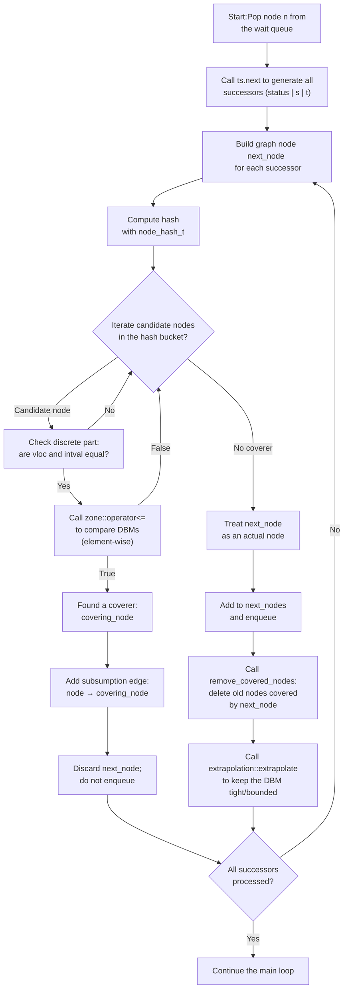
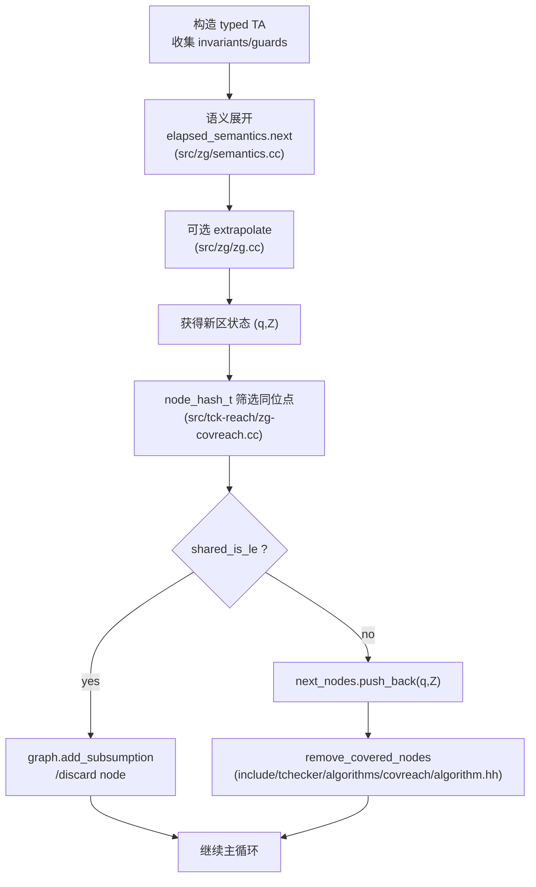

# 仿真关系实现对照

## 5.1 节仿真关系的代码对应
- **同一控制点筛选**：`node_hash_t` 只哈希离散部分 `tchecker::ta::shared_hash_value`，保证仅比较同一控制点及整型变量估值的结点 (`src/tck-reach/zg-covreach.cc:37`).
- **预序判定**：`node_le_t` 调用 `tchecker::zg::shared_is_le`，其先比对离散部分，再调用 `zone() <=` 做 zone 包含性检查 (`src/tck-reach/zg-covreach.cc:46`, `src/zg/state.cc:53`).
- **G(q) 的具体化**：zone 自身就是一组 DBM 约束，来源于初始零区、位置不变式、guard 以及 reset 的闭包。`elapsed_semantics_t::next` 中按“约束→reset→时间延展”顺序叠加这些原子约束 (`src/zg/semantics.cc:131-155`)，等价于论文中对 `pre(prog, G(q'))` 的构造（在无时钟赋值的设定下，`tchecker::dbm::reset` 退化为常见的 0/常数重置 `src/dbm/dbm.cc:330-347`).
- **δ≥0 的要求**：`elapsed_semantics` 会在目标可延时位置使用 `open_up` 展开未来时间 (`src/zg/semantics.cc:148-152`)，保证 zone 中的估值包含所有满足 δ 延时的解，从而与定义中“若 v+δ ⊨ φ 则 v'+δ ⊨ φ”保持一致。

## Z ⪯_{G(q)} Z' 的实现细节
- **Zone 包含性**：`shared_is_le` 调用 `zone::operator<=` (`src/zg/state.cc:53`, `src/zg/zone.cc:45-53`)，后者落到 DBM 按元素比较 (`src/dbm/dbm.cc:315-327`)，等价于检查所有原子约束是否在被覆盖 zone 中保持（论文的逐约束验证）。
- **同维度及空区处理**：实现先处理维度与空区特殊情形 (`src/zg/zone.cc:47-52`)，对应论文中对不可满足 zone 的 vacuous 成立情况。

## ¬(Z ⪯_{G(q)} Z') 的判定
- **否定测试**：`graph.is_covered` 在同一哈希桶内遍历候选结点，只要 `node_le_t` 返回 `false` 就认定未覆盖 (`include/tchecker/graph/cover_graph.hh:70-101`). 这正是老师强调的 `¬(Z_i ⪯_{G(q)} Z_j)` 情形：当 `dbm::is_le` 发现任一条约束更严格（`DBM1(i,j) > DBM2(i,j)`）便立即返回 `false` (`src/dbm/dbm.cc:323-327`)，从而拒绝 subsumption 并保留新结点。

## 终止性（第 8 节）对应
- **良性序的实现**：`covreach` 扩展结点后调用 `remove_covered_nodes`，把被新结点覆盖的旧结点删除 (`include/tchecker/algorithms/covreach/algorithm.hh:129-166`). 该函数通过 `covered_nodes` 查找所有被包含的 zone，并把其入边改为对新结点的 subsumption 边。由于 DBM 包含关系在同一控制点上构成良序，重复移除覆盖项确保探索不会在同一位置生成无限严格下降链，对应论文第 8 节的终止性证明。

## 小结
综上，论文 5.1 节预序 `⪯_G` 在代码中表现为：
1. 通过哈希筛选同一控制点；
2. 利用 zone（DBM）封装 `G(q)` 中的原子约束；
3. 用 `dbm::is_le` 执行约束逐项比较；
4. 在覆盖失败时保留新 zone，成功时删旧保新，借由良性序实现第 8 节的覆盖终止性保证。

## 自然语言解读
在覆盖算法里，工具会记住每个控制点配上一块“时间区域”（zone）。当新的区域出现时，我们先确认它指向同一个控制点，再检查老区域里的所有约束对新区域是否仍然成立。如果成立，就表示老区域的行为已经被新区域“模拟”，可以删掉老区域；否则就保留。这样做的好处是一方面能避免无限增加越来越“紧”的区域，另一方面也确保不会丢掉可能到达接受位置的行为，从而既保证终止又保持正确性。

## 第 8 节：Z ⪯G(q) Z′ 的代码化
- **G(q) 的形成路径**：当 `zg.next` 生成后继 `(q', Z')` 时，会按“源不变式 → guard → reset → 目标不变式 → 目标延时”的顺序约束并扩张 DBM (`src/zg/zg.cc:67-93`, `src/zg/semantics.cc:137-155`)。因此 zone 本身已经把第 8 节里定义的 `G(q)` 与后续延时闭包全都编码在 DBM 中。
- **同位点筛选**：`node_hash_t` 仅使用时序离散部分（位置 + 整型变量）来散列 (`src/tck-reach/zg-covreach.cc:37-41`)，确保只有同一 `q` 的节点才互相比较，契合论文对 `(q, Z_i)` 序列的假设。
- **仿真判定**：`graph.is_covered` 通过 `node_le_t` → `shared_is_le` → `zone::operator<=` → `dbm::is_le` 这一链路检查 `Z ⪯ Z'` (`include/tchecker/algorithms/covreach/algorithm.hh:170-188`, `include/tchecker/graph/cover_graph.hh:146-157`, `src/tck-reach/zg-covreach.cc:46-49`, `src/zg/state.cc:48-56`, `src/zg/zone.cc:45-54`, `src/dbm/dbm.cc:315-327`)。
- **判定 ¬(Z ⪯G(q) Z′)**：一旦 `dbm::is_le` 遇到任意约束 `DBM1(i,j) > DBM2(i,j)` 就立刻返回 `false` (`src/dbm/dbm.cc:323-326`)，整个覆盖链路也就把这个“反例”向上传回；`graph.is_covered` 因而认定新节点未被覆盖并保留它，正是论文所需的 `¬(Z_i ⪯ Z_j)` 检测。
- **有限性与终止**：若新节点反过来覆盖现有节点，`covreach` 会调用 `remove_covered_nodes` 删除被包含的旧 zone (`include/tchecker/algorithms/covreach/algorithm.hh:204-217`)。配合 LU/EL+ 局部外推保证 zone 取值有限 (`src/zg/zg.cc:62-63`)，实现第 8 节中“在同一 q 上存在 i<j 使 Z_i ⪯ Z_j”的良序性。

## 函数调用链详解

  - src/tck-reach/zg-covreach.cc:37-49
  - src/zg/state.cc:48-55
  - src/zg/zone.cc:45-54
  - src/dbm/dbm.cc:315-327
  - include/tchecker/graph/cover_graph.hh:146-152
  - include/tchecker/algorithms/covreach/algorithm.hh:170-188

1. **`covreach::expand_next_nodes`** (`include/tchecker/algorithms/covreach/algorithm.hh:170-188`)  
   - 输入：当前图节点 `node`、转移系统 `ts`、`next_nodes` 容器以及统计量。  
   - 机制：遍历 `ts.next` 给出的后继，把新节点加入 subsumption 图，并立刻询问 `graph.is_covered` 以决定保留或丢弃。  
   - 输出：未被覆盖的节点被放入 `next_nodes`，供主循环入队。
2. **`subsumption::graph_t::is_covered`** (`include/tchecker/graph/cover_graph.hh:146-157`)  
   - 输入：候选节点指针 `n`，输出参数 `covering_node`。  
   - 机制：在哈希冲突桶内枚举已有节点，逐个调用 `_node_le`（在本实例中是 `node_le_t`）判断 `n` 是否被覆盖。  
   - 输出：若存在覆盖者则返回 `true` 并填充 `covering_node`，否则返回 `false`。
3. **`node_le_t::operator()`** (`src/tck-reach/zg-covreach.cc:46-49`)  
   - 输入：两个 `node_t`。  
   - 机制：委托 `tchecker::zg::shared_is_le` 检查离散部分一致且 zone 包含。  
   - 输出：布尔值，`true` 表示第一个节点被第二个节点仿真。
4. **`zg::shared_is_le`** (`src/zg/state.cc:48-56`)  
   - 输入：两个 zone 图状态。  
   - 机制：先用 `ta::shared_equal_to` 比较位置/整型估值，再比较 zone 指针或调用 `zone() <=`。  
   - 输出：布尔值，标识状态层面的仿真。
5. **`zone_t::operator<=`** (`src/zg/zone.cc:45-54`)  
   - 输入：两个 zone。  
   - 机制：处理维度与空区特殊情形后，调用 `dbm::is_le` 做逐元素界比较。  
   - 输出：布尔值，判定 zone 是否包含。
6. **`dbm::is_le`** (`src/dbm/dbm.cc:315-327`)  
   - 输入：两份紧化后的 DBM 与维度。  
   - 机制：双重循环检查每个 `(i,j)` 约束是否满足 `DBM1 <= DBM2`，遇到违反立即返回 `false`。  
   - 输出：布尔值；为 `true` 时即证明仿真关系成立。

## 复杂度分析
- **后继展开 `expand_next_nodes`**：设当前节点的后继数为 `B`，每个后继都要调用一次覆盖判定，因此时间复杂度约为 `O(B · C_cover)`；额外空间开销与产生的未覆盖后继数成正比。
- **覆盖判定 `graph::is_covered`**：在哈希桶中顺序扫描，若桶内候选数为 `K`，则时间复杂度 `O(K · C_le)`，空间为常数。
- **状态/zone 仿真链**：`node_le_t` 与 `shared_is_le` 除常数操作外主要依赖 zone 包含检查，当 zone 维度为 `d` 时，`zone::operator<=` 和底层 `dbm::is_le` 的时间复杂度均为 `Θ(d^2)`。
- **总体估计**：对整个探索过程，若可达节点总数约为 `N`，平均分支因子为 `B`、平均桶内候选数为 `K`，则总时间复杂度可近似为 `O(N · B · K · d^2)`；空间复杂度主要由 subsumption 图和等待队列主导，最坏情况下与已探索节点数 `N` 成线性关系。

## reach 算法的仿真判定流程
- **DBM 逐元素比较**：当前实现中，`zone::operator<=` 直接调用 `dbm::is_le` 枚举两个 DBM 的所有元素 (`src/dbm/dbm.cc:315-327`)，仅当每条约束都满足 `DBM1(i,j) <= DBM2(i,j)` 时才认定存在模拟关系。没有额外的短路机制或投影，只要碰到一条约束违反便立即返回。
- **没有采用 min(G,G′)+负环检查**：代码中没有构造 `min(G,G′)` 或执行 Floyd-Warshall/负环检测的路径。`dbm::is_le` 纯粹比较已紧化的矩阵条目，因为 zone 在生成时已保持闭合（Floyd-Warshall）和紧化，所以逐项比较即可判断集合包含，这也是标准的 DBM 包含测试方式。
- **探索新 zone 时的处理**：
  - 若 `graph.is_covered` 判定存在模拟关系：`expand_next_nodes` 会添加一条 subsumption 边并丢弃新节点 (`include/tchecker/algorithms/covreach/algorithm.hh:170-188`)，即不将其压入等待队列，同时统计为“被覆盖”。
  - 若不存在模拟关系：新节点保持“实际”边，被加入 `next_nodes` 再交给等待队列；随后 `remove_covered_nodes` 会删除所有被新节点包含的旧节点，以维持良序 (`include/tchecker/algorithms/covreach/algorithm.hh:204-217`)。
- **总结**：流程并未使用 `min(G,G′)` 或负环检测，而是沿用经典的“紧化后逐元素比较”策略，依赖 DBM 的闭合性质保证判定正确性与效率。模拟成立时丢弃新节点并保留 subsumption 边；模拟不成立时保留新节点、必要时删旧节点。

## DBM 判定优化与 zone 有限性保证
- **比较阶段的优化**：`dbm::is_le` 在双重循环中一旦发现 `DBM1(i,j) > DBM2(i,j)` 就立即返回 `false` (`src/dbm/dbm.cc:323-326`)，因此虽然最坏复杂度仍为 `Θ(d^2)`，但在约束差异明显时能提前终止。没有额外的稀疏优化或块分解，但整体 DBM 已处于紧化状态，避免了重复工作。
- **zone 有限性的来源**：
  1. **紧化与闭包**：每次生成 zone 时都会调用 `tchecker::dbm::constrain`、`reset`、`open_up` 等操作，这些操作之后的 DBM 维持 Floyd-Warshall 闭合性，从而保证比较时只需逐元素检查。
  2. **Extrapolation**：`tchecker::zg::extrapolation_t::extrapolate`（在 `zg::next`、`zg::initial` 等流程中调用，见 `src/zg/zg.cc:62-63`）根据 LU 或 M 界限将 DBM 约束截断，从理论上限制每个控制点可出现的矩阵形状数量。
  3. **覆盖判定**：当新 zone 覆盖旧 zone 时立即删除旧节点，有助于避免在同一控制点上产生无限下降链。结合 extrapolation，最终 zone 集合在每个离散配置上都是有限的。

## Canonical 化与整体复杂度
- **是否额外 canonical 化**：`tchecker` 在生成新 zone 时，通过 DBM 的闭合和紧化操作已经获得所谓的 canonical 形式（闭包 + 最小化约束）；除此之外并无额外散列或排序步骤。
- **比较方式**：因此每次比较直接依赖前述的逐元素 `dbm::is_le`，没有缓存 diff 或增量更新的机制。
- **综合复杂度**：每当插入新节点时，复杂度为 `O(K · d^2)`（哈希桶候选数 `K` 与 DBM 大小 `d`）；若随后删除旧节点，会再触发若干 `node_le_t` 调用，但数量与覆盖节点个数成线性。这里的符号含义如下：
  - `N`：整个覆盖探索中实际保留的图节点数，即经过模拟剪枝后存储在 subsumption graph 中的 zone graph 节点数量。
  - `B`：`ts.next` 返回的后继数量的平均值，可视为符号搜索的平均分支因子（近似 BFS 的“邻接节点数”）。
  - `K`：哈希碰撞桶的平均元素数量（散列表大小由 `table_size` 决定），也就是与待比较节点哈希值相同的候选节点数。
  - `d`：DBM 的维度（等于时钟数加一），因此 `d^2` 对应逐元素比较的开销。
   结合这些参数，整体仍是上一节估计的 `O(N · B · K · d^2)` 级别，没有额外的超线性因子。但需要注意，`N` 自身可能随系统规模呈指数增长（传统结论表明 timed automata 可达性是 PSPACE-complete），因此整体算法并非保证多项式时间；复杂度的多项式表达仅反映在探索过程中每一步的局部代价。

## 关于哈希桶候选数
- **哈希桶的含义**：`subsumption::graph_t` 内部依赖 `tchecker::collision_table_t` 将节点按哈希值分桶 (`include/tchecker/utils/hashtable.hh`)。构造 subsumption graph 时需提供 `table_size`（哈希表大小）和值函数 `node_hash`（对节点离散部分散列）。
- **候选数量的来源**：对于任一申请覆盖检查的新节点 `n`，`graph.is_covered` 仅遍历与 `n` 哈希值相同的所有节点，即同一桶内的元素。桶内元素数量随哈希函数分布与实际状态扩展动态决定，理论上上限为桶内目前存储的节点数
- **用户可调参数**：`table_size` 在创建 subsumption graph 时由调用者（例如 `tck-reach`）选择，常与状态空间规模估计相关；选择足够大的表能降低碰撞几率并缩小平均 \(K\)。
- **哈希函数定义及作用**：在区域覆盖算法中，桶内元素都是共享指针 `node_sptr_t`，每个指向 `tck_reach::zg_covreach::node_t`。哈希函数 `node_hash_t::operator()`（`src/tck-reach/zg-covreach.cc:37-41`）只对离散部分（位置元组与整数变量估值）调用 `tchecker::ta::shared_hash_value`，确保只有落在同一控制点配置的节点被放入相同桶中，从而避免跨控制点的错误覆盖比较。
- **为何只遍历同桶元素**：`node_le_t::operator()` 的前提是两个节点具有相同的离散部分 (`src/tck-reach/zg-covreach.hh:84-93`)。哈希函数正是以离散部分为输入，因此哈希值相同意味着离散骨架一致，是进入覆盖比较的必要条件。遍历其他桶既无必要也会因离散部分不同而必定返回 `false`，故 `graph.is_covered` 只需枚举同桶节点即可。
- **离散部分的含义与示例**：Zone 图状态由“离散部分 + zone”构成，其中离散部分等同于 timed automaton 状态的 `(vloc, intval)`——即每个进程当前所在的位置（位置元组）以及所有有界整型变量的取值 (`include/tchecker/ta/state.hh:38-110`)。例如，对两个进程的模型，离散部分可能是 `((p1, q2), (x=1, y=0))`。只有当两个节点在这些位置与整型估值上完全一致时，才有意义比较它们的 zone DBM；哈希函数正是基于这组离散信息构造散列值。
- **`intval` 的解释**：`intval` 是系统中显式建模的有界整数变量估值 (`include/tchecker/ta/state.hh:62-109`)，与时钟取整无关。离散部分相等即意味着位置元组与这些整数变量值均一致；只有在此基础上才进一步比较 zone（即 DBM）的约束，判断模拟关系。

------

## Reach Algorithm Process

**overall complexity** `O(N · B · K · d^2)`

- N ： node size   in zone graph
- B：average adjacent node size in BFS
- K：average hash table size
- d：dimensions of DBM

**对角约束（Diagonal constraints）**：
 `tck-reach` 依赖于无对角线时钟边界求解器（`clockbounds::df_solver_t`）。
 当分析器遇到形如 `x - y # c` 的表达式时（`src/clockbounds/solver.cc:384-392`, `include/tchecker/clockbounds/solver.hh:31,259-272`），处理 guard 的访问器会抛出 `"unsupported diagonal constraints"`（不支持的对角约束）异常。
因此，当前的命令行工具（CLI）会拒绝包含对角时钟约束的模型。

- **Zone 传播流水线（Zone propagation pipeline）**：
   在状态展开过程中，`ts.next` 调用 `zg::next`（`src/zg/zg.cc:67-120`）。
   这个过程执行以下步骤：
  1. 调用 `ta::next` 更新离散数据（包括 guard、reset、invariant）；
  2. 对前驱 zone 应用 `elapsed_semantics_t::next`（`src/zg/semantics.cc:137-155`）：
      依次执行——与源状态不变量求交、与 guard 求交、应用 reset、与目标不变量求交，并可选地对目标 zone 进行 `open_up` 操作；
  3. 调用 `zg::extrapolation_t::extrapolate`（`src/zg/zg.cc:62-63`），
      以确保生成的 `Zone2` 保持紧凑（tight）并处于 LU 界限内。

因此，zone 的**规范化（canonicalisation）** 主要来自于 DBM 自身的操作以及 extrapolation 过程；
 最终得到的 zone 会被用于之前所描述的仿真关系（simulation relation）检查。

## 无对角约束仿真流程（现状总结）

1. **模型预检查**：在构建 `ta::system_t` 后立即调用 `ta::has_diagonal_constraint`（`src/ta/static_analysis.cc:37-53`）。一旦在 guard 或 invariant 中检测到 `x - y # c` 形式，前端就会拒绝该系统，确保后续算法只面对单时钟约束。
2. **LU 边界求解**：`clockbounds::compute_clockbounds`（`src/clockbounds/clockbounds.cc:54-118`）会实例化 `df_solver_t`。它将所有 guard/invariant 通过 `df_solver_expr_updater_t::visit`（`src/clockbounds/solver.cc:330-406`）解析成单时钟上下界：`add_upper_bound_guard`/`add_lower_bound_guard` 仅处理 `x # c`，并以参考时钟 `0` 为比较对象。该阶段也处理 reset/赋值，产生可用于 extrapolation 的局部/全局 L、U、M 映射。
3. **Zone 语义执行**：在每次 `zg::next`（`src/zg/zg.cc:67-120`）调用里，`elapsed_semantics_t::next`（`src/zg/semantics.cc:137-155`）按“源 invariant ∩ guard → reset → 目标 invariant → open_up”顺序更新 DBM。由于输入保证没有 diagonal guard，All resets 也都是 `x := 0` 或 `x := const`/`x := y + c` 中 `y` 是参考时钟，从而 DBM 操作始终保持标准形式。
4. **Extrapolation 依赖 LU**：`zg::extrapolation_t::extrapolate`（`src/zg/extrapolation.cc:200-236`）读取步骤 2 中的 L/U/M map（例如 `local_extra_lu_plus_t`），对 zone 应用 Extra LU/M。算法假设每个钟都存在有限上下界；若缺失（例如 diagonal guard 会导致 `compute_clockbounds` 抛错），整个 extrapolation 链条无法工作。
5. **仿真/覆盖检查**：当 `covreach` 生成新节点时，通过 `node_hash_t` 与 `node_le_t`（`src/tck-reach/zg-covreach.cc:31-63`）对同一控制点的 zone 执行 `zone::operator<=`（`src/zg/zone.cc:45-53`）。该比较等价于在 DBM 中逐元素检查单时钟约束是否被包含，因此只要 LU 边界确保 DBM 维度一致，即可可靠地产生仿真关系。
6. **终止保证**：`remove_covered_nodes`（`include/tchecker/algorithms/covreach/algorithm.hh:204-217`）依赖 Extra LU/M 把 DBM 限定在有限上界内，防止出现无限严格递减链；这正是“无对角约束”假设的重要产物——只要每个钟都能通过 LU 得到有限 bound，就能在同一位置上对 zone 形成良性序，保证覆盖搜索终止。

综上所述，当前实现的仿真关系流程以“所有 clock 约束均为单钟”作为硬前提：该前提既驱动静态检查，也贯穿 clock bounds、zone 语义、extrapolation 乃至覆盖判定。任何违反该前提的模型都会在 clock bounds 阶段被拒绝，从而避免破坏后续仿真关系的正确性与终止性。

## 对角约束仿真流程（新增支持）

- **Clock-bounds 退化**：`compute_clockbounds` 会在检测到 `ta::has_diagonal_constraint(system)` 后，仅对 `clockbounds_t` 做 `resize` 并输出 warning，LU/M map 保持 `NO_BOUND` (`src/clockbounds/solver.cc:441-455`)，让 zone 语义直接依赖 DBM 表示。
- **Extrapolation 回退**：若用户仍请求 `EXTRA_*` 抽象，`zg::extrapolation_factory` 会强制改用 `NO_EXTRAPOLATION` 并提示 (`src/zg/extrapolation.cc:200-210`)，以避免把单钟 LU 逻辑用于对角约束。
- **仿真关系不变**：`node_le_t → shared_is_le → dbm::is_le` 的判定流程无需改动，因为 DBM 天然存储 `x - y # c`，所以当 LU/M 缺失时依旧可以比较两个 zone 的“对角张量”。
- **文档指引**：最新的 `diagonal.md` 与 `include/tchecker/zg/extrapolation.hh` 说明了上述 fallback，提醒工具链在含对角 guard 的模型上预期更保守（但 sound）的覆盖搜索。

## 复杂度与退化理由

- **退化前**：LU/Extra 抽象将每个 zone 的上界截断到由 `clockbounds::df_solver_t` 推导出的常数，配合覆盖剪枝可在实践中大幅减少 zone 数量，即便最坏情况仍与退化后相同（完整 zone 图），平均复杂度约为 `O(N · d^2)`（`N` 为经剪枝后的节点数，`d` 为时钟数）。
- **退化后**：取消抽象意味着保持精确 DBM，单步操作仍是 `O(d^2)`～`O(d^3)`，但状态数可能等于完整 zone 图，最坏复杂度上升到 `O(Z · d^2)`，`Z` 可能呈指数级。
- **为什么引入对角约束会增复杂度**：`x - y # c` 关联多钟常数，Extra-LU 无法找到安全截断界，如果强行抽象会破坏仿真正确性，因此只能维持精确 zone。
- **忽略对角约束为何能降复杂度**：当限制在单钟约束时，所有 zone 均存在有限 LU 常数，可将无限上界收束到一个有限集合，从而保证覆盖与终止性；这是 diagonal-free 算法能高效运行的根源。
- **LU/Extra 终止性的核心**：`clockbounds::df_solver_t` 会为每个（位置，时钟）求出最大可能的上界 `U(l,x)` 与下界 `L(l,x)`；Extra-LU 抽象把 zone 中所有 `x - 0` 较大的约束裁剪到 `U(l,x)`，并将 `0 - x` 裁剪到 `L(l,x)`。因此，在固定的控制点上，DBM 的每个矩阵条目只能取有限多种值，覆盖算法便不会生成无限严格下降链，从而保证探索终止。
- **上界如何求得**：`df_solver_t` 把每条 guard 与赋值转换为形如 “`U(l,x) ≥ c`”、“`U(l1,x) ≥ U(l2,y) - c`” 的不等式，并将跨进程共享時計入所有相关位置。求解该不等式系统（本质是最短路径/最长路径问题）后得到的最小解即 `U`/`L`。这些常数概括了所有可能执行路径上某钟的最大约束强度，为 Extra-LU 提供截断阈值。
- **对角约束为何打破 LU**：在二维时钟平面里，简单约束限定的是轴对齐矩形；而 `x - y ≤ c` 则对应整片位于直线 `x - y = c` 下方的半平面，沿 `(1,1)` 方向可以无限延伸。只要某些路径允许 `x`、`y` 同时增大，差值仍满足约束，但 `x` 与 `y` 个别的上界就是无穷，`df_solver_t` 因而无法给出有限 `U(l,x)`、`U(l,y)`，Extra-LU 也就失去截断的依据，只能退回精确 DBM。

## G-simulation 实现细节

- **静态约束收集（对应 $G(q)$）**：构造 `ta::system_t` 时，位置的不变量与边的 guard 被类型化表达式封装，并在 `tchecker::zg::semantics_t::initial/next/final` 中按“源不变量 → guard → reset → 目标不变量 → 时间延展”顺序叠加到 DBM 上（`src/zg/semantics.cc:115-155`）。这套逆向传播等价于论文中对 `pre(prog,G(q'))` 的不动点展开，让 zone 自带后继会用到的全部原子约束。
- **赋值级预序（`v ⪯_G v'`）**：`zone::operator<=` 通过调用 `tchecker::dbm::is_le`（`src/zg/zone.cc:45-53`, `src/dbm/dbm.cc:315-327`）逐元素比较 DBM。矩阵中的每条差分约束 `x_i - x_j ≤ c` 只有在目标 zone 中同样成立时才算包含，这正好实现了“所有未来 δ≥0 的原子约束都被保持”的语义定义。
- **节点覆盖（`(q,Z) ⪯_A (q,Z')`）**：`tck-reach`/`covreach` 在扩展节点后调用 `node_le_t → shared_is_le → zone::operator<=`（`src/tck-reach/zg-covreach.cc:31-63`）来检查同一控制点上的 zone 是否被模拟，若成立则在 `cover_graph` 中添加 subsumption 边并跳过后续展开（`include/tchecker/graph/cover_graph.hh:70-157`, `include/tchecker/algorithms/covreach/algorithm.hh:170-217`）。
- **终止与剪枝**：当新节点存活时，`remove_covered_nodes` 会删除被它覆盖的旧节点，避免无限下降链；当节点被覆盖时直接丢弃不再探索。配合（退化前的）Extra-LU 输出有限约束集，正是论文第 8 节终止性证明的工程化落地。

## 补充说明：为何保留 Extra-LU/M

- **现状架构**：自最初版本起，zone 覆盖仿真 (`node_le_t → shared_is_le → dbm::is_le`) 就一直与 Extra-LU 并行存在；前者负责 subsumption，后者负责把 DBM 限定在有限集合。
- **拒绝对角约束的根源**：`df_solver_t` 只接受单钟 guard。为了避免产生失真抽象，旧代码在 `df_solver_expr_updater_t::visit(diagonal)` 中直接抛异常，导致含对角 guard 的模型被前端拒绝。
- **为何不直接移除 extrapolation**：
  - 对角线自由的模型占绝大多数；Extra-LU/M 能显著压缩状态空间并给出清晰的终止性证明，硬删会让这些场景性能、内存大幅倒退。
  - 生态链上多处算法（aLU-covreach、局部时间分析等）依赖 `clockbounds` 数据；拔掉 extrapolation 会牵一发动全身。
  - G-simulation 在理论上可替代，但要纯粹依赖它，需要对性能、验证流程做更多工程投入。当前策略是在检测到对角线时退化到 `NO_EXTRAPOLATION`，其余场景继续沿用成熟的 Extra-LU。
- **未来工作**：若要完全支撑对角线，还需补齐仍声明 `not_supported(diagonal)` 的模块（如 VM 编译器）、探索更高效的对角-aware 抽象。在此之前，保留 Extra-LU/M + 退化策略是兼顾正确性与性能的折中。

## Roadmap：向纯 G-simulation 迁移的改造要点

1. **显式构造 `G(q)`**
   - 现状：`elapsed_semantics_t::next` 在运行时递归地把 guard/reset/invariant 的影响叠加到 zone，但没有缓存 `G(q)`。
   - 工作项：编写静态分析模块，对所有控制点求不动点 `G(q)`，输出为一组差分约束（可复用 DBM 数据结构）。

2. **重写覆盖判定**
   - 现状：`node_le_t → shared_is_le → zone::operator<= → dbm::is_le` 已经实现了论文的赋值仿真；但缺少“寻找反例 v 的三类负环模板”这种显式流程。
   - 工作项：根据论文中 `G_v^G`、`g_v^G` 的定义实现反例检测，将 zone 覆盖判定重构为纯 G-simulation 与 DBM SAT 结合的流程，确保涵盖 diagonal 情况。

3. **剥离 extrapolation 依赖**
   - 现状：`zg::factory` 默认传入 `EXTRA_LU_PLUS_LOCAL`，同时代码多处（如 `zg-aLU-covreach`）需要本地 LU map。
   - 工作项：
     1. 为现有二进制另开纯仿真模式（如 `tck-reach-gsim`），默认不调用 `compute_clockbounds`，直接以 `NO_EXTRAPOLATION` 构造 `zg`；
     2. 调整 `state_space_t`、`graph_t`，让它们在该模式下不依赖 LU 数据；
     3. 等新模式稳定后，再考虑逐步淘汰 aLU 覆盖、局部时间分析等依赖 LU 的算法。

4. **兼容性与性能验证**
   - 现状：Extra-LU 对 diagonal-free 模型极其高效；纯仿真可能导致节点暴涨。
   - 工作项：构建长列表测试（无对角/有对角）、记录状态数与运行时间，比较不同前端的性能（现有 + G-sim-only），必要时探索新的差分抽象或启发式。

5. **其它阻塞点**
   - VM/字节码生成器（`src/vm/compilers.cc`）目前仍在 diagonal 访问器里 `not_supported`；未来若要在仿真模式下执行字节码，需要扩展这些分支。
   - 静态分析工具（如 clockbounds cache）依赖 LU bound，也要评估是保留退化还是完全替换。

> 建议先在文档中保持此 roadmap，逐步开辟新 pipeline，并在确认性能与正确性后再考虑删去旧的 extrapolation 代码。

## 对论文 5.1 小节的代码映射与差异说明

下表将论文 *5.1 A concrete simulation relation for GTA* 的关键步骤与当前代码进行对照，并指出尚未覆盖的差异点：

| 论文要点 | 现有实现 | 差异/备注 |
| --- | --- | --- |
| 配置仿真关系 `(q,v) ⪯ (q,v')` 的两条条件（延时保持 & 离散步保持） | `shared_is_le` 检查共享离散骨架后调用 `zone::operator<=`/`dbm::is_le` (`src/zg/state.cc:53`, `src/zg/zone.cc:45-53`)；因为语义生成的 zone 已编码 guard、reset、时间延展，延时与离散步均使用同一 DBM 包含关系验证 | 论文把两条条件拆开陈述，代码通过 DBM 运算“一次性满足”，没有显式的引理编码 |
| 赋值预序 `v ⪯_G v'` | `dbm::is_le` 逐元素比较差分约束 ( `x_i - x_j ≤ c` )，正是“所有 φ ∈ G 在任意 δ ≥ 0 下保持”的离散化形式 (`src/dbm/dbm.cc:315-327`) | 论文定义允许 δ 使 `v(x)+δ>0`，代码中 `open_up` 会在生成后继时放宽时钟以模拟该行为 (`src/zg/semantics.cc:148-152`) |
| `pre(prog,G)` 的逆向传播 | guard / reset 被 `elapsed_semantics_t::next` 依序处理（`src/zg/semantics.cc:137-155`）；`reset` 的四种情形对应 `dbm::reset` 与 `release` 操作 (`src/dbm/dbm.cc:330-347`) | 没有单独导出的 `G_v^G`、`g_v^G` 结构，也没有显式 `pre` 函数；而是把结果直接叠加进 zone |
| `G(q)` 的最小不动点 (公式 (4)) | 代码未显式存储 `G(q)`；相当于在每次语义展开时即时应用 `pre` 并把原子约束写入 zone | 若要完全复现论文形式，需要独立的静态分析模块缓存 `G(q)`，目前属于未来 roadmap |
| Lemma 13（reset 后仿真保持） | 由 `dbm::reset` 和 `dbm::constrain` 的组合保证；`shared_is_le` 在 reset 后仍比较归一化 DBM，从而间接实现条件 | Lemma 未在代码中以独立形式呈现，但行为与证明一致 |
| Theorem 14（⪯_A 是仿真） | 覆盖算法依赖 `shared_is_le`+`remove_covered_nodes` (`include/tchecker/algorithms/covreach/algorithm.hh:170-217`)；当包含成立时 subsume，失败则保留新节点 | 形式证明仍在论文中；代码默认其结论，未在实现内复述 |

**结论**：核心语义（延时、guard、reset、多 δ 比较）已在 DBM 与仿真流程中隐含实现，但缺乏论文式的显式 `G(q)`/`pre` 结构。如果要完全对齐论文，需要：

1. 将 `G(q)` 抽取成离线数据结构（见“Roadmap”第 1 步），并提供 `pre` 的可复用 API；
2. 实现论文给出的三类负环模板的反例生成，以便更透明地解释“zone 不覆盖”的原因；
3. 在文档或代码注释中补充对 Lemma 13、Theorem 14 的工程化对应关系，便于后续维护者查证。

目前仍待实现的论文要素总结：

- 显式的 `G(q)` 最小不动点计算和缓存，集中管理“未来需保持”的原子约束；
- 统一的 `pre(prog, G)` API，按 guard / reset 逆向传播约束；
- 对应 Lemma 49 的 `G_v^G、g_v^G` 构造与三类负环模板，用于给出仿真失败的反例；
- 针对 reset/release 仿真保持的显式封装（论文 Lemma 13），目前仅由 DBM 操作隐式保证；
- 代码内缺少对 Theorem 14（仿真关系成立）的注解或单元测试案例；
- 仍有模块（如 VM 编译器）在遇到对角约束时直接 `not_supported`，尚未覆盖论文的通用模型。

## 核心数据结构与方法速览（实现映射）

**tchecker::dbm 命名空间**（`src/dbm/dbm.cc`, `include/tchecker/dbm/**/*.hh`）

- `db_t`：差分约束的基础结构，记录比较符（< / ≤）与常数；常量 `LE_ZERO`、`LT_INFINITY` 等定义 DBM 中的零约束与无穷上界。
- 初始化与复制：`copy`、`universal`、`universal_positive`、`zero`、`empty` 用于构造标准形态的 DBM，以供后续运算使用。
- 判定函数：`is_consistent`、`is_empty_0`、`is_universal`、`is_positive`、`contains_zero`、`is_tight` 检查 DBM 的一致性、空性或是否包含零估值。
- 规范化：`tighten(dbm, dim)`（Floyd–Warshall 闭包）确保所有隐式约束显式化；局部版本 `tighten(dbm, dim, x, y)` 可只更新一个条目。
- 约束应用：`constrain(dbm, dim, x, y, cmp, value)` 及其对 `clock_constraint_t`/容器的重载按 guard/invariant 更新 DBM，返回是否导致空区；`satisfies` 系列用于验证单条约束或具体估值。
- Reset 操作：`reset_to_value`、`reset_to_clock`、`reset_to_sum` 与封装的 `reset(...)` 实现 `x := c`、`x := y`、`x := y + c`；`free_clock` 在逆向语义中解除对某些时钟的约束。
- 时间推进：`open_up` 将所有 `x-0` 边设为 `<∞`，再配合 `tighten` 得到延时闭包；这正是语义中“时间流逝”步骤的底层实现。
- Extrapolation：`extra_m`、`extra_m_plus`、`extra_lu`、`extra_lu_plus` 根据静态上下界裁剪 DBM（对角场景通过退化禁用）。
- 其他工具：`is_le`/`is_am_le`/`is_alu_le` 支撑 zone 包含判定；`hash`、`lexical_cmp`、`constrain_to_single_valuation` 等函数辅助缓存、排序与测试。

**tchecker::zg::zone_t**（`include/tchecker/zg/zone.hh`, `src/zg/zone.cc`）

- `is_empty`、`is_universal_positive` 快速检测空区与仅含非负时钟的区域。
- `operator<=`、`is_am_le`、`is_alu_le` 直接调用 DBM 判定函数实现 zone 包含，是覆盖剪枝的核心；`lexical_cmp`、`hash`、`output` 分别用于排序、散列与调试输出。
- `belongs` 判断具体估值是否落在当前 zone；`dbm()` / `to_dbm()` 暴露底层 DBM 指针，供语义或算法内联操作（注意需保持 tightness）。

**tchecker::zg::semantics_t 及派生类**（`include/tchecker/zg/semantics.hh`, `src/zg/semantics.cc`）

- `standard_semantics_t`：按“延时 → guard → reset → 目标约束”构造 successor/predecessor zone，主要用于参考或逆向分析。
- `elapsed_semantics_t`：`next` 顺序为“源 invariant ∩ guard → reset → 目标 invariant →（如允许）open_up”，对应论文 `pre(prog, G)` 的逆向传播；`prev` 则执行相反流程。
- `semantics_factory`：在 `STANDARD` 与 `ELAPSED` 之间选择（reachability 默认使用后者）。

**tchecker::zg::state_t**（`src/zg/state.cc`）

- `shared_is_le`：确保离散骨架一致后比较 zone 或复用共享 DBM，正是 `(q,Z) ⪯_A (q,Z')` 的代码化判定。
- `is_alu_le`、`shared_is_alu_le`：在 aLU 模式下使用的包含检查，未来若迁移到纯 G-simulation 可重构或移除。

以上结构组合实现了论文中涉及的数学操作：DBM 负责差分约束计算，`zone_t` 封装成可共享的区域对象，`elapsed_semantics_t` 实现 `pre`/`post` 序列，`shared_is_le` 则完成仿真覆盖检测。

## 退化后算法的终止性直觉

在允许对角线约束的实现中，我们退化到“纯 DBM + 覆盖仿真”，不再依赖 LU/M 截断。终止性依赖以下几点：

1. **语义生成的 zone 已编码 G(q)**：`elapsed_semantics_t::next` 在 guard、reset、时间展开后，把目标控制点需要保持的差分约束全部写入 zone。相当于始终维持论文定义的 `G(q)`，无需额外缓存。
2. **覆盖删除避免无限下降链**：`shared_is_le` 比较两个 zone 时，只要新 zone 的约束全部被旧 zone 覆盖，就立即 subsume；若某条约束更强，旧节点会被删除。这与论文证明的“仿真序良性”一致。
3. **理论基础来自 G-simulation**：文献已经证明 `⪯_A` 在正确选择的 `G(q)` 下只有有限多种互不覆盖的 zone。我们虽然未显式记录 `G(q)`，但因语义层把约束写入 DBM，仍遵循同一理论基础。

因此，退化后的算法依旧沿用论文的有限性证明逻辑（仿真剪枝保证收敛），只是放弃了 LU/M 带来的额外截断。实测中，虽然 zone 数量可能增多，但算法仍能在有限步内终止。

## 对角线退化模式的复杂度估计

即便禁用 extrapolation（LU/M 截断），主循环仍沿用上面给出的 BFS 框架，只是去掉 `dbm::extra_lu(...)`。对维度 `d = |X| + 1` 的 DBM 而言：

- 每次 `elapsed_semantics_t::next` 中的 `dbm::constrain` 是 O(d²)，`dbm::reset_to_*` 后的 `dbm::tighten` 与 `dbm::open_up/tighten` 是 O(d³)。
- 覆盖判定 `shared_is_le → zone::operator<= → dbm::is_le` 仍是 O(d²)。

若记 `N` 为最终保留下来的节点数，`B` 为平均出边数，`K` 为同一离散骨架下需要比较的候选节点数，则退化模式的总开销约为 `O(N · B · d³ + N · B · K · d²)`。虽然缺少 LU/M 截断会增大 `N`，但覆盖关系依旧保证探索在有限步内终止。

------

## 非对角线（含 LU/M 截断）复杂度估计

在经典（无对角线）模式下，前述 BFS 框架会保留 `dbm::extra_lu(...)` 这一截断步骤，核心开销可按以下函数估算（`d = |X| + 1`）：

- `elapsed_semantics_t::next`：依次调用  
  `dbm::constrain`（源 invariant / guard）、  
  `dbm::reset_to_value/clock/sum` + `dbm::tighten`（重置并保持规范）、  
  `dbm::constrain`（目标 invariant）、  
  `dbm::open_up` + `dbm::tighten`（时间延展及闭包），整体 O(d³)。
- `dbm::extra_lu` / `extra_lu_plus`：用 `clockbounds::df_solver_t(compute_clockbounds)` 离线求得的 `L/U` 对矩阵逐元素裁剪，O(d²)。
- 覆盖判定 `shared_is_le → zone::operator<= → dbm::is_le`：逐项比较差分约束，O(d²)。
- 离线阶段 `compute_clockbounds`：遍历全部 guard/reset 并求最短路径，约 O(|T| · d²)。

因此，设 `N` 为最终保留下的节点数、`B` 为平均出边数、`K` 为同一离散骨架下需要比较的候选节点数，则整体成本近似  
`O(N · B · d³ + N · B · K · d²)`（加上单次的 `O(|T| · d²)` 离线成本）。Extra-LU 将 DBM 条目压缩到有限集合，使得 `N` 在实践中远小于对角线退化模式，终止性也直接由传统 LU 理论保证。

## 核心 DBM 操作与语义对比

- `dbm::constrain(dbm, dim, x, y, cmp, value)`：将差分约束 `x - y # value`（`#` 为 `<` 或 `≤`）与当前 DBM 相交，用于叠加 guard / invariant；并提供对 `clock_constraint_t` 及容器的重载。
- `dbm::open_up(dbm, dim)`：将所有 `x - 0` 边重置为 `<∞`，实现“任意时间延展”；通常需紧跟 `dbm::tighten` 保持闭包。
- `dbm::tighten(dbm, dim)`：执行 Floyd–Warshall 闭包，显式化隐含约束并检测负环；局部版本 `tighten(dbm, dim, x, y)` 可仅更新单条边。

- `standard_semantics_t`（标准语义）：遵循“delay → guard → reset → target invariant”的顺序，先允许时间流逝，再应用离散动作；常用作参考或逆向分析。
- `elapsed_semantics_t`（延时语义）：按照“guard → reset → target invariant → delay”的顺序，先执行离散动作，再进行时间延展，与论文 `pre(prog, G)` 的逆向传播顺序一致，是当前 reachability 工具的默认语义。
